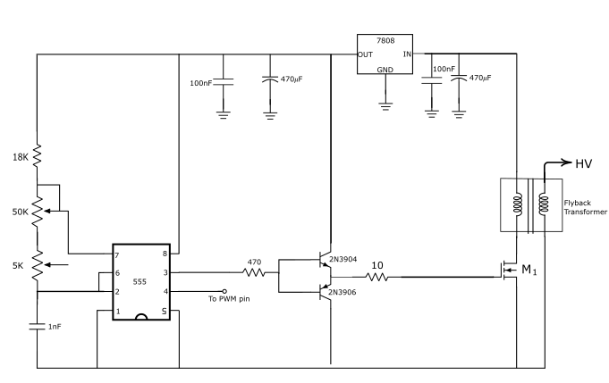

# 🎵 Musical Flyback Driver — 555 Oscillator + Microcontroller Modulator

A high-voltage flyback transformer driver that plays music through its arc. A 555 timer
generates the high-frequency drive signal, and an Arduino modulates it at audio
frequencies, so the arc itself acts as a speaker.

> ⚠️ **High voltage warning:** This circuit produces lethal voltages at the flyback output.
> Do not build or operate it without high-voltage experience. Work on it only when
> unplugged and with the output discharged.

## Demo
[Video link / GIF of the arc playing music]

## Schematic


## How It Works

1. **Supply:** a 7808 regulator derives a clean 8 V rail for the 555 and gate buffer from
   the main [XX V] supply, which also feeds the flyback primary. Both rails are decoupled
   with 100 nF + 470 µF.

2. **Carrier oscillator (555, astable):** generates the square wave that switches the
   MOSFET. Timing components are R1 = 18 kΩ + 50 kΩ pot, R2 = 5 kΩ pot, C = 1 nF.

   f = 1.44 / ((R1 + 2·R2)·C)

   This gives a tunable carrier from about 18 kHz up to several tens of kHz, so the
   drive frequency can be matched to the flyback for the best arc. The duty cycle stays
   high (~80–95%), giving the primary a long charging time each cycle.

3. **Interrupter / modulator (microcontroller):** the Arduino's pin 9 drives the 555's
   RESET pin (pin 4), so the microcontroller directly modulates the 555's output.
   Pulling RESET low stops the oscillator; releasing it lets the carrier run. This
   on-off modulation of the high-frequency carrier works on two levels:
   - **Modulation frequency → pitch:** the rate at which carrier bursts are let through
     sets the note you hear from the arc.
   - **Modulation duty cycle → intensity:** the length of each burst controls how much
     energy goes into the arc, which changes the loudness and arc size.

   The 555 handles the fast switching the flyback needs, while the microcontroller
   shapes that signal at audio rates, so the arc reproduces the music.

4. **Gate buffer:** the 2SK2611 has a large gate charge (~58 nC), more than the 555 output
   can switch quickly on its own. A complementary emitter-follower (2N3904 / 2N3906),
   fed through a 470 Ω base resistor, sources and sinks the gate current quickly. A 10 Ω
   gate resistor damps ringing on the gate.

5. **Power stage:** a Toshiba 2SK2611 (K2611) N-channel MOSFET switches the flyback
   primary. When it turns off, the collapsing field produces a large voltage spike that
   the flyback steps up to high voltage, producing the arc.

Because the arc heats and expands the surrounding air in pulses, modulating it at audio
frequencies produces sound directly, with no speaker cone.

### Why the 2SK2611?
Salvaged from a dead Class-D audio amplifier. It's a 900 V, 9 A N-channel MOSFET in a
TO-3P package with ~1.1 Ω typical on-resistance, so it handles the inductive kickback
from the primary with plenty of margin.

## Components

| Part | Value / Model | Notes |
|------|---------------|-------|
| Timer | NE555 | Astable carrier |
| Regulator | 7808 | 8 V rail for 555 and buffer |
| Timing resistors | 18 kΩ + 50 kΩ pot (R1), 5 kΩ pot (R2) | Frequency / duty tuning |
| Timing capacitor | 1 nF | |
| Gate buffer | 2N3904 + 2N3906 | Complementary emitter-follower |
| Base resistor | 470 Ω | |
| Gate resistor | 10 Ω | Damps gate ringing |
| MOSFET | Toshiba 2SK2611 (K2611), salvaged | 900 V / 9 A, TO-3P |
| Decoupling | 2 × (100 nF + 470 µF) | Input and 8 V rails |
| Flyback transformer | [source, e.g. salvaged CRT] | |
| Microcontroller | Arduino [Uno / Nano] | Interrupter and modulator, output on pin 9 |
| Supply | [XX V, XX A] | |

## Firmware

Both sketches run on an Arduino and output on **pin 9**, which drives the 555's RESET pin.

### `pwm.ino` — manual signal generator
A serial-controlled PWM generator built on the
[TimerOne](https://github.com/PaulStoffregen/TimerOne) library. Frequency
(1 Hz – 1 MHz) and duty cycle (0–100%) are entered in the Serial Monitor
(9600 baud, Newline line ending). The sketch checks that on/off times stay above 0.2 µs
and only applies valid settings. It starts at 1 kHz, 50% duty. Useful for:
- Testing and tuning the driver at a fixed tone
- Exploring how modulation duty cycle changes burst length, and with it arc intensity
  and volume

### `star_wars.ino` — music playback
Plays the Star Wars main theme through the arc. The melody is stored as an array of
note frequencies and durations (dotted notes encoded as negative durations). For each
note, `tone()` outputs a square wave at the note's frequency on pin 9, gating the 555
carrier so the arc sounds that pitch. Each note plays for 90% of its duration, leaving
a short gap so repeated notes stay distinct. Tempo is adjustable via `tempo`.

Melody and playback code by Robson Couto, from
[arduino-songs](https://github.com/robsoncouto/arduino-songs), adapted to drive the
flyback interrupter.

## Challenges & Lessons Learned
- **Gate drive:** driving a high-gate-charge MOSFET straight from a 555 gives slow edges
  and switching losses. The complementary buffer sharpened the transitions and reduced
  heating.
- **Tuning:** the two pots let the carrier frequency be adjusted live to find the
  flyback's sweet spot for the strongest, most stable arc.
- **EMI:** [how you kept arc noise from upsetting the microcontroller]

## Future Improvements
- Drain protection (TVS diode or RC snubber) to clamp turn-off spikes on the MOSFET
- 10 nF decoupling cap on the 555's CONTROL pin (pin 5) for a more stable carrier
- Optical isolation between the microcontroller and the power stage
- Polyphonic playback / live MIDI input

## Repository Structure

```
├── firmware/
│   ├── pwm/pwm.ino
│   └── star_wars/star_wars.ino
├── images/
│   └── flyback.png
└── README.md
```

## Credits
- Song playback code: [Robson Couto — arduino-songs](https://github.com/robsoncouto/arduino-songs)
- PWM timing: [TimerOne library](https://github.com/PaulStoffregen/TimerOne)

## License
MIT (excluding third-party code, which remains under its original license)
